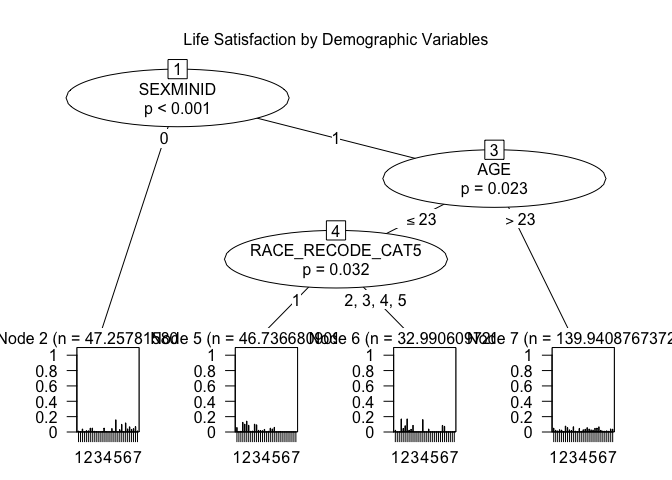
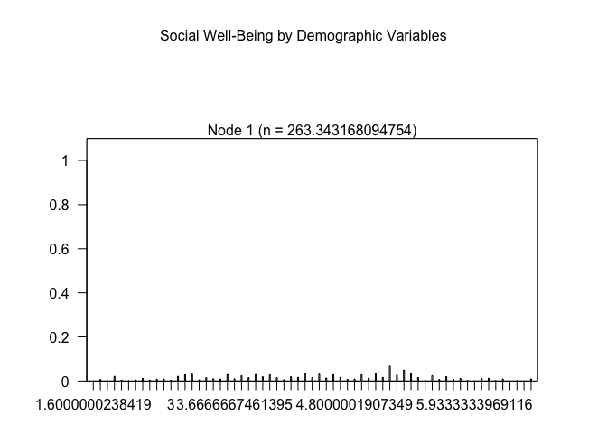
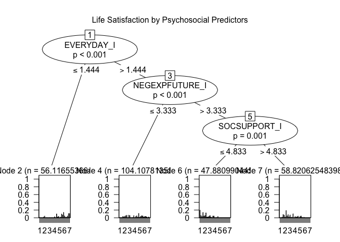
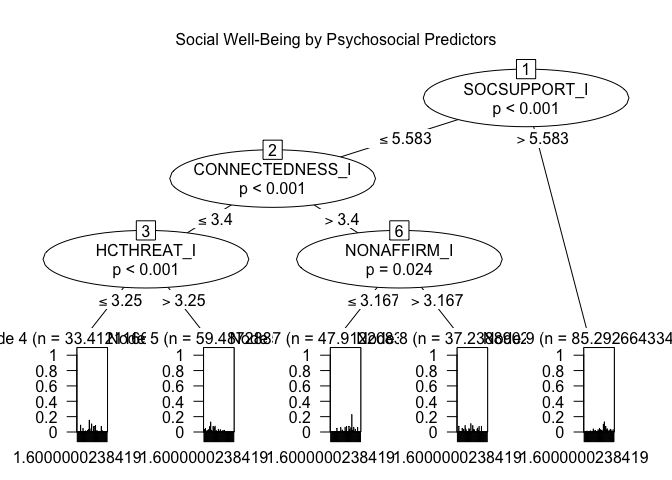
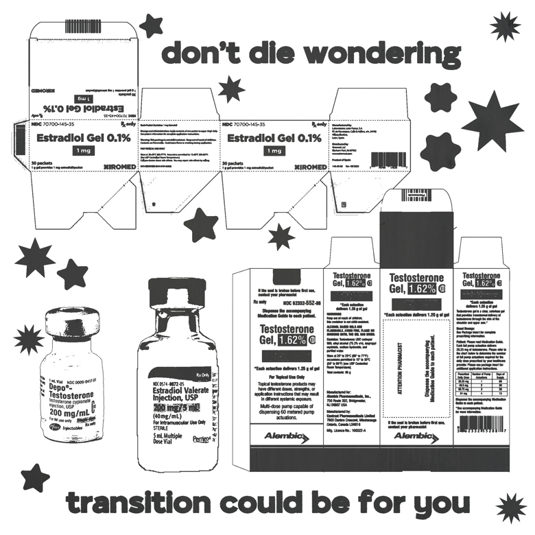
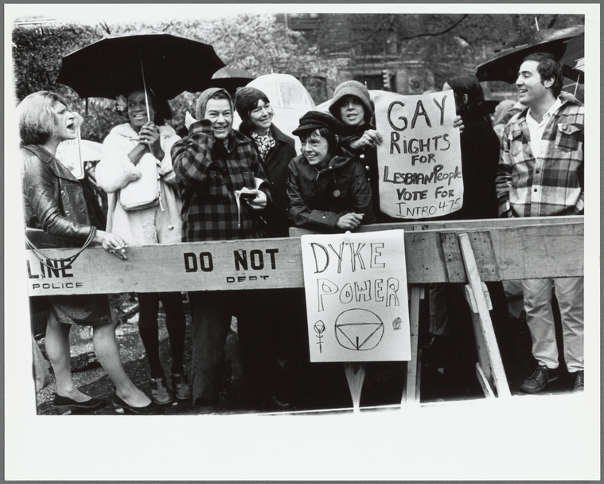

Let Trans Lives Thrive
================
Zoe Penzarro Habel
May 6th, 2025

As an undergraduate researcher, I’ve had the privilege of exploring and
familiarizing myself with a few public-use datasets and assisting my
professors with various parts of the research process. One data set I’ve
worked with several times is
[**TransPop**](https://doi.org/10.3886/ICPSR37938.v1), a nationally
representative survey on transgender health which includes data from 274
transgender and gender nonconforming (TGNC) adults as well as and 1,162
cisgender adults conducted between 2016-2018 (Meyer 2021).

The recent attacks on TGNC rights have been on my mind a lot, and
putting my energy into research helps me feel a bit more in control.
When I got this assignment, I knew I wanted to look at TransPop again
because I knew there was so much more to investigate. What I didn’t
expect was the new banner which greeted me at the top of the research
repository:

> On March 31, 2025, as a sponsor of this project, NIH requested that
> the following language be added to this website: This repository is
> under review for potential modification in compliance with
> Administration directives.

##### I cannot find the words to adequately express how angry I am about the politicization of parts of the human experience as beautiful as transness and the queer community. In lieu of an eloquent statement, I’d like to offer some hope.

## **Project Background + Research Aims**

For this brief project, I decided to investigate the impact of stressors
specific to the trans community on the social well-being and
satisfaction with life of TGNC adults. By identifying patterns in the
data, I endeavor to uncover what makes a TGNC person more likely to
thrive, and thus, how we can help transgender lives flourish.

### ***Question: Which experiences and stressors (or the lack thereof) are most pertinent to the social well-being and satisfaction with life of TGNC adults?***

## **Procedure**

I chose to utilize a conditional inference tree model for my analysis.
Conditional inference trees offer a robust method for regression
analysis in decision trees and work well with multivariate analysis.

13 variables were included as potential predictors in the conditional
inference tree models. Four total models were fitted; one tree with only
the 4 demographic variables included as predictors for both outcome
measures, and one tree with the 9 remaining variables included as
predictors for both outcome measures.

**For detailed information on the measures and survey items as well as
full citations for the subscales included in this paper, please see the
official methods and technical notes document for the TransPop survey
(Krueger et al., 2020).**

### **Demographics**

**Age, race, gender-identity, and sexual minority identity were included
as demographic variables.** Age was measured in years. For race, the
variable in which responses were recoded as White,
Black,Latino/Hispanic/Spanish origin, Multirace, and “other” was used
for analysis (race_recode_cat5). Since the data from cisgender adults is
not included in analysis for this paper, gender identity includes trans
man (FTM), trans woman (MTF), or transgender gender nonbinary. Sexual
minority identity is a binary label, with 0 representing hetereosexual
and 1 representing any sexual minority identity labels (homosexual,
bisexual etc).

### **Measures**

#### ***Outcome variables***

I chose social well-being and satisfaction with life as my two outcome
measures. Only complete cases were included for these composite scores.

**Social Well-Being**  
This 15-item scale (Keyes, 1998) evaluates individuals’ perceived social
wellness, including their sense of community belonging, comfort, and
societal contribution. Participants rate statements like *“I don’t feel
I belong to anything I’d call a community”* (reverse-coded) and *“My
community is a source of comfort”* on a 7-point Likert scale (1 =
*strongly disagree*, 7 = *strongly agree*). Eight items are
reverse-coded before calculating a mean score (range: 1–7), with higher
scores reflecting stronger social well-being—greater feelings of
connection, support, and purpose in society.

**Satisfaction with Life Scale (SWLS)**  
The SWLS (Diener et al., 1985) measures global life satisfaction through
five items (e.g., *“In most ways my life is close to ideal”* and *“I am
satisfied with life”*), rated on a 7-point Likert scale (1 = *strongly
disagree*, 7 = *strongly agree*). A mean score (range: 1–7) is computed,
where higher scores indicate greater life satisfaction—more positive
judgments about one’s life overall.

#### ***Predictors***

Each of the 9 variables included as predictors in this analysis are
*composite scores* calculated from empirically validated scales included
as survey items in the original questionnaire. **Missing data was
replaced with predicted mean matching imputation,** with both imputed
and non-imputed versions of the composite scores available for analysis
within the dataset. **I chose to use the imputed composite scores as
predictors in my analysis.** The predictors included were categorized as
**identity, healthcare access & utilization, or stressors** by the study
authors.

1.  **Identity:**
    - **Community Connectedness**: A 5-item scale (1–5) assessing
      transgender community affiliation; higher mean scores indicate
      stronger connectedness.  
    - **Non-Affirmation of Gender Identity**: A 6-item scale (1–5)
      measuring perceived lack of understanding/acceptance; higher mean
      scores indicate greater non-affirmation.
2.  **Healthcare access & utilization:**
    - **Healthcare Stereotype Threat**: A 4-item scale (1–5) assessing
      fear of being judged by providers due to LGBT identity; higher
      mean scores indicate greater worry.
3.  **Stressors:**
    - **Internalized Transphobia**: A 6-item scale (1–5) measuring
      self-directed stigma; higher mean scores indicate stronger
      internalized transphobia.  
    - **Everyday Discrimination**: A 9-item scale (1–4, reverse-coded)
      assessing chronic discrimination; higher mean scores indicate more
      frequent experiences.  
    - **Childhood Gender Conformity**: A 4-item scale (1–5) categorizing
      participants (based on sex at birth) into deciles of gender
      nonconformity (1 = most GNC, 3 = least GNC).  
    - **Gender Identity Non-Disclosure**: A 5-item scale (1–5) measuring
      avoidance of disclosing gender identity; higher mean scores
      indicate greater concealment efforts.  
      -**Negative Expectations of the Future**: A 9-item scale (1–5)
      assessing anticipated rejection due to gender identity; higher
      mean scores indicate more pessimistic expectations.  
    - **Social Support**: A 12-item scale (1–7) measuring perceived
      support; higher mean scores indicate stronger social support.

## **Analysis**

First, I loaded the packages `partykit` and `tidyverse` for fitting my
conditional inference tree models and data wrangling respectively.

I then used the `read.delim` function from the `readr` subpackage to
load the tab seperated values file containing the data downloaded from
the [ICPSR repository](https://doi.org/10.3886/ICPSR37938.v1).

``` r
transpop <- read.delim("37938-0005-Data.tsv")
```

Here’s a quick preview of the raw data:

``` r
head(transpop)
```

### Data cleaning + wrangling

The process of preparing the data for analysis was fairly
straightforward because the TransPop data is already in tidy format. The
raw data is pretty large, with 1436 rows and 612 columns. Because the
scope of this particular research is pretty narrow, I decided to create
a smaller subset of the dataset for my analysis which only included TGNC
adults and the specific variables included in my analysis.

To do this, I used the `filter` function from the `dplyr` subpackage to
subset the data to only include TGNC adults. Then I used the `select`
function to choose only the columns I needed for my analysis in my
subset. Finally, I used the `mutate` function to designate gender
identity, race, and sexual minority identity as factors, which is
neccessary because otherwise R will treat these variables as numeric
when they are actually categorical.

``` r
transonly <- transpop |>
  filter(GENDER_IDENTITY > 2) |>
  select(
    STUDYID,
    WEIGHT_TRANSPOP,
    #demographics
    GENDER_IDENTITY,
    RACE_RECODE_CAT5,
    SEXMINID,
    AGE,
    #trans-specific variables
    INTERNALIZED_I,
    EVERYDAY_I,
    CHILDGNC_I,
    NONDISCLOSURE_I,
    NEGEXPFUTURE_I,
    SOCSUPPORT_I,
    CONNECTEDNESS_I,
    NONAFFIRM_I,
    HCTHREAT_I,
    #positive health outcomes
    LIFESAT,
    SOCIALWB
  ) |>
  mutate(
    GENDER_IDENTITY = as.factor(GENDER_IDENTITY),
    RACE_RECODE_CAT5 = as.factor(RACE_RECODE_CAT5),
    SEXMINID = as.factor(SEXMINID)
  )
```

``` r
head(transonly)
```

This subset now has 274 rows and 17 columns, which will be much more
efficient for fitting models.

------------------------------------------------------------------------

## Model fitting

The **partykit::ctree** package implements [conditional inference
trees](https://www.zeileis.org/papers/Hothorn+Hornik+Zeileis-2006.pdf),
a non-parametric regression tree method that embeds recursive
partitioning into a framework of conditional hypothesis testing (Hothorn
et al., 2006). For a more indepth explanation of this method, please see
the [package
documentation](https://cran.r-project.org/web/packages/partykit/vignettes/ctree.pdf).

Key features include:

1.  **Unbiased Splitting**:
    - Uses permutation tests to select covariates and split points,
      avoiding bias toward variables with many splits.  
    - Tests global independence (via *p*-values) between covariates and
      response; stops if no significant association exists.
2.  **Flexibility**:
    - Handles diverse response types (numeric, ordinal, censored,
      multivariate) and covariates (nominal, ordinal, numeric).  
    - Supports weights, missing data (via surrogate splits), and
      clustered observations.
3.  **Algorithm**:
    - **Step 1**: Select the covariate with the strongest association
      (smallest *p*-value).  
    - **Step 2**: Choose the optimal split by maximizing a standardized
      statistic (e.g., mean differences).  
    - Recursively repeats until stopping criteria (e.g., alpha-level,
      sample size) are met.

As stated previously, 13 variables were included as potential predictors
in the conditional inference tree models. Four total models were fitted;
one tree with only the 4 demographic variables included as predictors
for both outcome measures, and one tree with the 9 remaining variables
included as predictors for both outcome measures. The code for fitting
these models is included below.

``` r
# Life satisfaction - demographics only
lifesat_tree1 = ctree(
  formula = as.ordered(LIFESAT) ~ AGE + GENDER_IDENTITY + RACE_RECODE_CAT5 +
    SEXMINID,
  data = transonly,
  minbucket = 26,
  multiway = T,
  na.action = na.omit,
  weights = WEIGHT_TRANSPOP
)

# Social wellbeing - demographics only
socialwb_tree1 = ctree(
  formula = as.ordered(SOCIALWB) ~ AGE + GENDER_IDENTITY + RACE_RECODE_CAT5 +
    SEXMINID,
  data = transonly,
  minbucket = 26,
  multiway = T,
  na.action = na.omit,
  weights = WEIGHT_TRANSPOP
)

# Life satisfaction - stressors only
lifesat_tree_stressors = ctree(
  formula = as.ordered(LIFESAT) ~ INTERNALIZED_I +
    EVERYDAY_I + CHILDGNC_I + NONDISCLOSURE_I +
    NEGEXPFUTURE_I + SOCSUPPORT_I + CONNECTEDNESS_I +
    NONAFFIRM_I + HCTHREAT_I + SEXMINID,
  data = transonly,
  minbucket = 26,
  multiway = T,
  na.action = na.omit,
  weights = WEIGHT_TRANSPOP
)

# social wellbeing - stressors only
socialwb_tree_stressors = ctree(
  formula = as.ordered(SOCIALWB) ~ INTERNALIZED_I +
    EVERYDAY_I + CHILDGNC_I + NONDISCLOSURE_I +
    NEGEXPFUTURE_I + SOCSUPPORT_I + CONNECTEDNESS_I +
    NONAFFIRM_I + HCTHREAT_I + SEXMINID,
  data = transonly,
  minbucket = 26,
  multiway = T,
  na.action = na.omit,
  weights = WEIGHT_TRANSPOP
)
```

------------------------------------------------------------------------

## **Results**

#### **1. Demographic Predictors**

**Life Satisfaction (`LIFESAT`)**  
The model identified sexual minority status (`SEXMINID`) as the primary
splitting variable. Heterosexual participants (`SEXMINID`=0) exhibited
higher mean life satisfaction (*M* = 4.80) than sexual-minority
(`SEXMINID`=1) participants.

Among sexual minorities, `AGE` produced a secondary split. For those 23
years old or youger, race further differentiated outcomes: - White
participants (`RACE_RECODE_CAT5`=1) showed slighly lower life
satisfaction (*M* = 2) - Black, Latino/Hispanic, Multirace, or Other
(`RACE_RECODE_CAT5`=2-5) showed slightly higher life satisfaction
(*M*=2.20)

Participants older than 23 years had a mean life satisfaction score of
2.2 regardless of race.

    ## 
    ## Model formula:
    ## as.ordered(LIFESAT) ~ AGE + GENDER_IDENTITY + RACE_RECODE_CAT5 + 
    ##     SEXMINID
    ## 
    ## Fitted party:
    ## [1] root
    ## |   [2] SEXMINID in 0: 4.8000001907349 (w = 47.3, err = 84.4%)
    ## |   [3] SEXMINID in 1
    ## |   |   [4] AGE <= 23
    ## |   |   |   [5] RACE_RECODE_CAT5 in 1: 2 (w = 46.7, err = 85.1%)
    ## |   |   |   [6] RACE_RECODE_CAT5 in 2, 3, 4, 5: 2.2000000476837 (w = 33.0, err = 82.4%)
    ## |   |   [7] AGE > 23: 2.2000000476837 (w = 139.9, err = 92.3%)
    ## 
    ## Number of inner nodes:    3
    ## Number of terminal nodes: 4

<!-- -->

**Social Well-Being (`SOCIALWB`)**  
No significant splits emerged, with the model yielding only a root node
(*M* = 5.13), indicating that demographic variables alone did not
meaningfully partition social well-being in this sample.

    ## 
    ## Model formula:
    ## as.ordered(SOCIALWB) ~ AGE + GENDER_IDENTITY + RACE_RECODE_CAT5 + 
    ##     SEXMINID
    ## 
    ## Fitted party:
    ## [1] root: 5.1333332061768 (w = 263.3, err = 93.2%) 
    ## 
    ## Number of inner nodes:    0
    ## Number of terminal nodes: 1

<!-- -->

#### **2. Psychosocial and Stress-Related Predictors**

**Life Satisfaction (`LIFESAT`)**  
Everyday discrimination (`EVERYDAY_I`) was the primary partitioning
variable. Participants reporting lower discrimination (≤1.44) exhibited
the highest life satisfaction (*M* = 5.80). Among those reporting higher
discrimination (\>1.44), negative future expectations (`NEGEXPFUTURE_I`)
further differentiated outcomes. Those with fewer negative expectations
of the future for TGNC individuals (≤3.33) reported the greatest mean
(though still moderate) life satisfaction of this group (*M* = 4.80),
whereas those with greater negative expectations (\>3.33) were further
differentiated based on social support (`SOCSUPPORT_I`). Low support
(≤4.83) was associated with the lowest satisfaction (*M* = 1.00), while
higher support (\>4.83) corresponded to moderately better outcomes (*M*
= 2.20).

    ## 
    ## Model formula:
    ## as.ordered(LIFESAT) ~ INTERNALIZED_I + EVERYDAY_I + CHILDGNC_I + 
    ##     NONDISCLOSURE_I + NEGEXPFUTURE_I + SOCSUPPORT_I + CONNECTEDNESS_I + 
    ##     NONAFFIRM_I + HCTHREAT_I + SEXMINID
    ## 
    ## Fitted party:
    ## [1] root
    ## |   [2] EVERYDAY_I <= 1.44444: 5.8000001907349 (w = 56.1, err = 85.5%)
    ## |   [3] EVERYDAY_I > 1.44444
    ## |   |   [4] NEGEXPFUTURE_I <= 3.33333: 4.8000001907349 (w = 104.1, err = 88.3%)
    ## |   |   [5] NEGEXPFUTURE_I > 3.33333
    ## |   |   |   [6] SOCSUPPORT_I <= 4.83333: 1 (w = 47.9, err = 80.9%)
    ## |   |   |   [7] SOCSUPPORT_I > 4.83333: 2.2000000476837 (w = 58.8, err = 81.4%)
    ## 
    ## Number of inner nodes:    3
    ## Number of terminal nodes: 4

<!-- -->

**Social Well-Being (`SOCIALWB`)**  
Social support (`SOCSUPPORT_I`) served as the initial splitting
criterion. Participants with high support (\>5.58) reported greater
well-being (*M* = 5.13). Among those with lower support (≤5.58),
subsequent splits occurred based on community connectedness
(`CONNECTEDNESS_I`) as a secondary factor and healthcare stereotype
threat (`HCTHREAT_I`) and non-affirmation of gender identity
(`NONAFFIRM_I`) as tertiary factors. The lowest well-being (*M* = 3.27)
was observed among individuals with low connectedness and high
healthcare threat, whereas the highest well-being in this subgroup (*M*
= 5.27) was found among those with high connectedness and fewer
experiences of non-affirmation.

    ## 
    ## Model formula:
    ## as.ordered(SOCIALWB) ~ INTERNALIZED_I + EVERYDAY_I + CHILDGNC_I + 
    ##     NONDISCLOSURE_I + NEGEXPFUTURE_I + SOCSUPPORT_I + CONNECTEDNESS_I + 
    ##     NONAFFIRM_I + HCTHREAT_I + SEXMINID
    ## 
    ## Fitted party:
    ## [1] root
    ## |   [2] SOCSUPPORT_I <= 5.58333
    ## |   |   [3] CONNECTEDNESS_I <= 3.4
    ## |   |   |   [4] HCTHREAT_I <= 3.25: 4 (w = 33.4, err = 84.4%)
    ## |   |   |   [5] HCTHREAT_I > 3.25: 3.2666666507721 (w = 59.5, err = 86.2%)
    ## |   |   [6] CONNECTEDNESS_I > 3.4
    ## |   |   |   [7] NONAFFIRM_I <= 3.16667: 5.2666668891907 (w = 47.9, err = 76.6%)
    ## |   |   |   [8] NONAFFIRM_I > 3.16667: 4.1999998092651 (w = 37.2, err = 88.6%)
    ## |   [9] SOCSUPPORT_I > 5.58333: 5.1333332061768 (w = 85.3, err = 87.2%)
    ## 
    ## Number of inner nodes:    4
    ## Number of terminal nodes: 5

<!-- -->

------------------------------------------------------------------------

### **Discussion**

The conditional inference trees revealed distinct patterns in how
demographic and psychosocial variables partitioned life satisfaction and
social well-being.  

These findings align with prior research linking minority stress and
social support to well-being in TGNC populations. The prominence of
discrimination and support in the trees underscores their relevance in
models of TGNC health. Future studies using longitudinal or experimental
designs may help clarify the temporal and directional dynamics of these
relationships. A significant limitation of the present study is that
only a few key factors were considered, and a mediation analysis with
further moderating factors was not performed. Future studies should
consider including more factors and a mediation analysis. Another
limitation of this paper is that, bluntly, I could not figure out how to
make the plots look better which leads to slightly confusing
visualization.  

Trans lives deserved to be cherished, honored, and protected. Beyond
that TGNC deserve to flourish. These findings highlight the importance
of creating and fostering safe spaces for TGNC individuals to connect
with (`CONNECTDEDNESS_I`) and support (`SOCIAL_SUPPORT`) one another,
especially for TGNC youth. Additionally, increasing awareness of the
adverse effects of invalidating identities (`NONAFFIRM_I`) and creating
trans-inclusive environments within healthcare (`HCTHREAT_I`) could help
TGNC induviduals thrive. Fostering community and hope for the future
(`NEGEXPECT_I`) within these supportive spaces might also increase how
satisfied TNGNC individuals are with their lives. Of course, reducing
instances of everyday discrimination would be ideal, and potentially
could increase the life satisfaction of TGNC adults as demonstrated by
the model (`EVERYDAY_I`).  

**Though this may feel like too big of a hurdle, transgender activists
such as Marsha P Johnson and Sylvia Rivera made massive strides in how
TGNC folks are treated and viewed in society today. The torch is now
ours, and it’s important not to give up hope. Trans is forever.**

> If transgender rights are important to you, please let your
> representatives know by signing [this petition from the
> ACLU](https://action.aclu.org/petition/defend-trans-freedom).

> To learn more about the ACLU’s role in the upcoming supreme court case
> and the stories of TGNC individuals impacted by it, see the [“Freedom
> to Be”
> Campaign](https://www.aclu.org/campaigns-initiatives/freedom-to-be).

------------------------------------------------------------------------

## Local resources for TGNC folks

The **Massachusetts Transgender Political Coalition** offers **free
gender affirming garments** through their **G.E.A.R.** – *Gender
Euphoria and Affirmation Resources* initiative. To learn more and/or
request garments, visit their website
[here](https://www.masstpc.org/what-we-do/gear/).

Simmons University is steps away from **Fenway Health**, a national
leader in gender affirming healthcare and research and actually was a
primary contributor to the TransPop study. **They are currently
accepting new patients**. Learn more about their services and/or request
a provider visit their website
[here](https://fenwayhealth.org/care/medical/transgender-health/).

------------------------------------------------------------------------

[](https://ko-fi.com/i/IH2H31829O7)

[](https://digitalcollections.nypl.org/items/510d47e3-57a1-a3d9-e040-e00a18064a99)

##### To read about the roots of the transgender rights movement and the Street Transvestite Action Revolutionaries organization spearheaded by Marsha P Johnson & Sylvia Rivera, please see this [edited collection from Untorelli Press](https://web.archive.org/web/20190309213709/https://untorellipress.noblogs.org/files/2011/12/STAR.pdf).

## References

Hothorn T, Hornik K, Zeileis A (2006). “Unbiased Recursive Partitioning:
A Conditional Inference Framework.” Journal of Computational and
Graphical Statistics, 15(3), 651–674.
<a href="https://doi:10.1198/106186006X133933"
class="uri">https://doi:10.1198/106186006X133933</a>

Hothorn T, Zeileis A (2015). “partykit: A Modular Toolkit for Recursive
Partytioning in R.” Journal of Machine Learning Research, 16, 3905-3909.
<https://jmlr.org/papers/v16/hothorn15a.html>.

Krueger, E. A., Divsalar, S., Luhur, W., Choi, S. K., & Meyer, I. H.
(2020). TransPop - U.S. Transgender Population Health Survey
(Methodology and Technical Notes). Los Angeles, CA: The Williams
Institute. Retrieved from:
<https://www.transpop.org/s/TransPop-Survey-Methods-v18-FINAL-copy.pdf>

Meyer, I. H. (2021). TransPop, United States, 2016-2018 \[Dataset\].
Inter-university Consortium for Political and Social Research
\[distributor\]. <https://doi.org/10.3886/ICPSR37938.v1>
